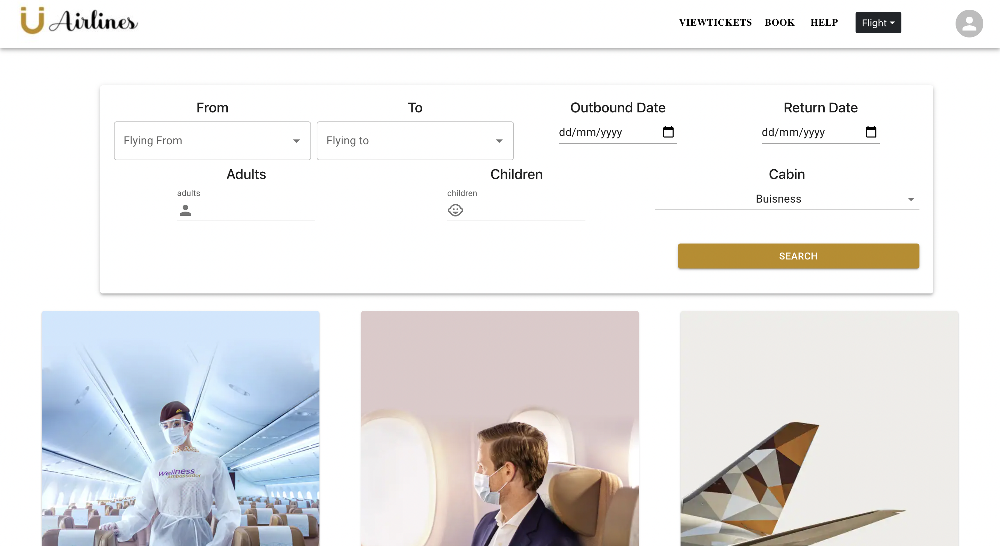
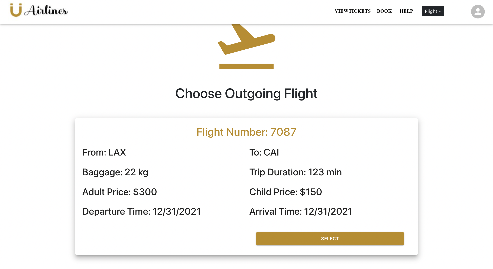
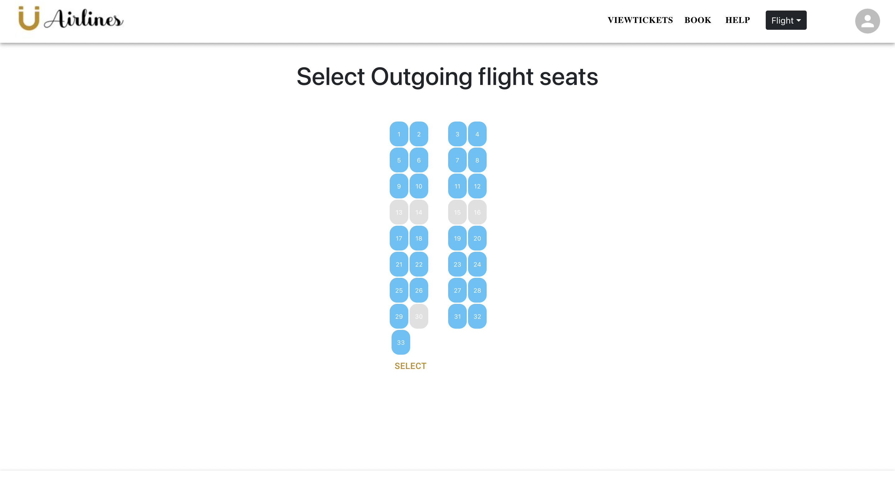
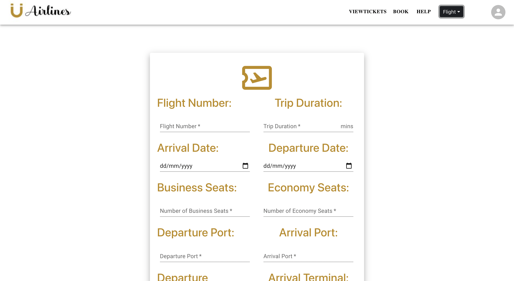
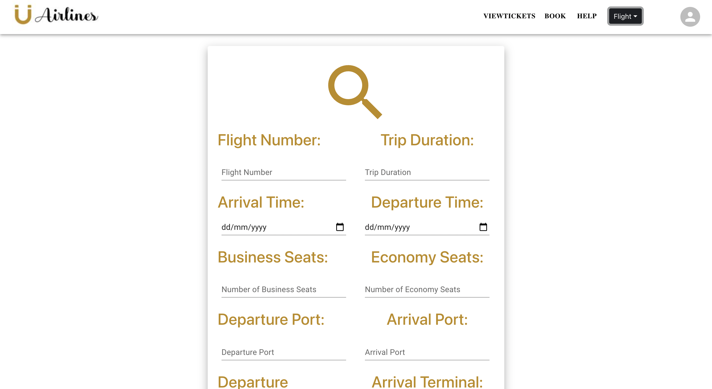
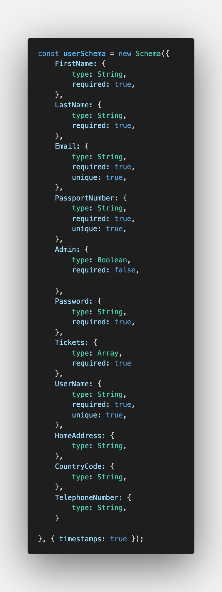
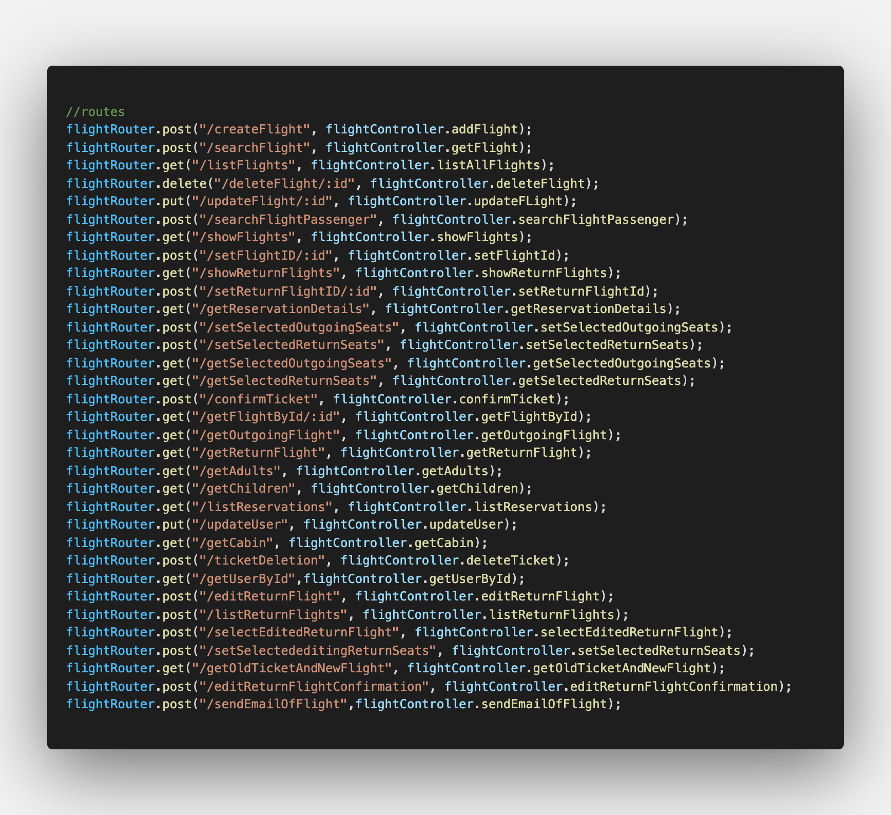
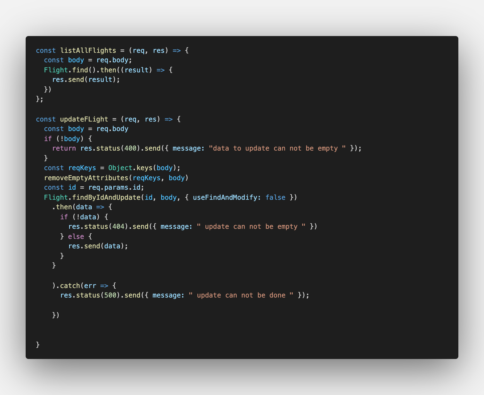
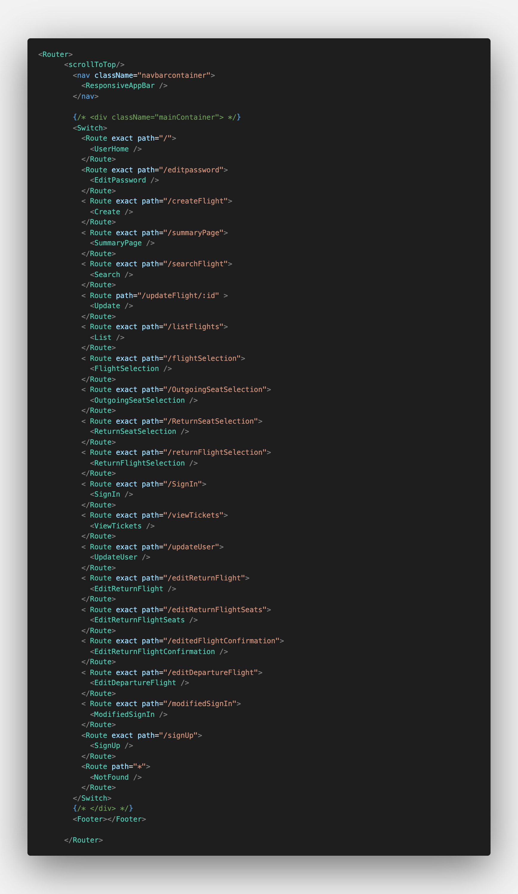
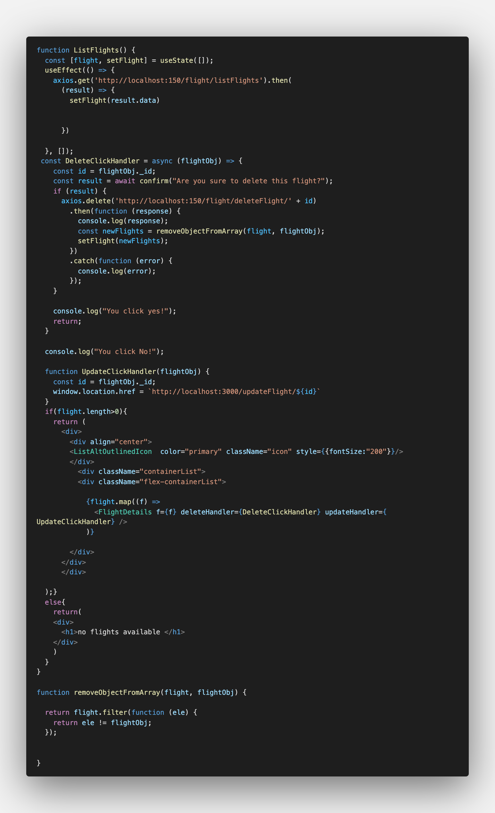

# Unique-and-in-English-only
 ---
 

+ Team members:
+ * Ahmed Elghobashy
  * Karim Elshaarawy
  * Mohamed Elshaarawy
  * Ahmed Ramadan
  * Alfarouk Amr


### Unique Airlines Reservation System


> It is a airline reservation system where Admin can add ,edit ,delete Flights from the system and logged in users can search for flights,reserve seats and confirm tickets and make payments with credit card. User can also view his tickets and edit or cancel reserved flights and email himself with his itinerary, While guest can search for avaialable flights but cannot confirm ticket without signing in.  

### Motivation 


we decided to create this project for the following reasons :
1. learning Agile software engineering
2. Building complete frontend with nice UI and UX
3. Using MERN stack to build full software project
4. Dealing with several APIs like Nodemailer and Stripe

### Build status 
Most of the functionality of the project working well with some reloading issues. The whole system needs to be tested.

### Code style
+ we sticked to camelcase naming convention while naming variables.
+ we used Model-View-Controller (MVC) as a design pattern for the project.


### Screenshots 
Here are some Screenshots from the website.

- User homepage



- Flight Selection



- Seats Selection 



- Admin Flight Creation



- Admin Flight Search



### Technology
In this project we used [MERN](https://www.geeksforgeeks.org/mern-stack/) stack and serveral APIs that includes
+ [MongoDB](https://www.mongodb.com/) is the DBMS we used to store flights and users information.
+ [Express](https://expressjs.com/) is Back-end web application framework for Node.js
+ [React](https://reactjs.org/) is the front-end javascript library that is used to build User Interfaces.
+ [Node.js](https://nodejs.org/en/) is an back-end JavaScript runtime environment that executes JavaScript code outside a web browser. 


+ [Mongoose](https://mongoosejs.com/) allows back-end to send or retrieve data from MongoDB.

+ [Axios]( https://www.npmjs.com/package/axios) is used to connect back-end with front-end.

### Installation
 First you should install [Node.js](https://nodejs.org/en/) then install the following 

 ```python

npm install express react axios nodemailer mongoose cors dotenv
bootstrap @stripe @mui @material-ui @emotion
 ```

### Code Examples
Here are some snippets of the code

- User Schema 



- Flight Router



- Flight Controller 



- App Router



- Admin list all available flight





### API Reference

+ [Nodemailer](https://www.npmjs.com/package/nodemailer) API is used to send emails to user on ticket confirmation or deletion.

+ [Stripe](https://stripe.com/en-gb-us) API allows user to pay for reservation using credit card.

### Features
* Beautiful and simple UI and UX
* Easy to learn and User friendly website


###  Resources
+ [Mongo CRUD](https://www.youtube.com/watch?v=W1Kttu53qTg&t=7850s)
+ [MUI library](https://mui.com/)
+ [React net ninja](https://www.youtube.com/watch?v=j942wKiXFu8&list=PL4cUxeGkcC9gZD-Tvwfod2gaISzfRiP9d)

### Credits 

+ Karim ELshaarawy
 [LinkedIn](https://www.linkedin.com/in/karim-elshaarawy/)
 Email:
karimelshaarawy2000@gmail.com


### License

Copyright (c) 2022   Karim elshaarawy

Permission is hereby granted, free of charge, to any person obtaining a copy of this software and associated documentation files (the "Software"), to deal in the Software without restriction, including without limitation the rights to use, copy, modify, merge, publish, distribute, sublicense, and/or sell copies of the Software, and to permit persons to whom the Software is furnished to do so, subject to the following conditions:

The above copyright notice and this permission notice shall be included in all copies or substantial portions of the Software.

THE SOFTWARE IS PROVIDED "AS IS", WITHOUT WARRANTY OF ANY KIND, EXPRESS OR IMPLIED, INCLUDING BUT NOT LIMITED TO THE WARRANTIES OF MERCHANTABILITY, FITNESS FOR A PARTICULAR PURPOSE AND NONINFRINGEMENT. IN NO EVENT SHALL THE AUTHORS OR COPYRIGHT HOLDERS BE LIABLE FOR ANY CLAIM, DAMAGES OR OTHER LIABILITY, WHETHER IN AN ACTION OF CONTRACT, TORT OR OTHERWISE, ARISING FROM, OUT OF OR IN CONNECTION WITH THE SOFTWARE OR THE USE OR OTHER DEALINGS IN THE SOFTWARE.
